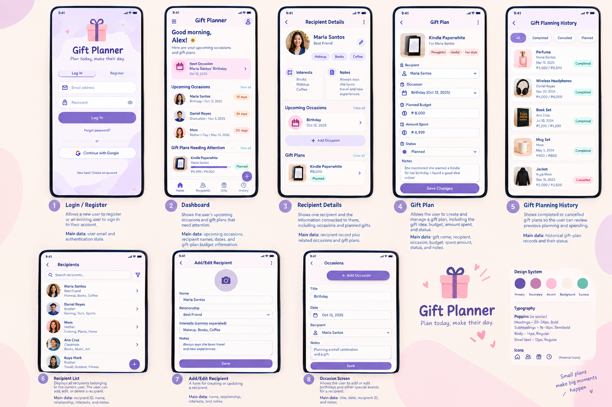

# Gift Planner

**Live demo:** https://nowenpascual28-bot.github.io/gift_planner/

**Course:** Applications Development and Emerging Technologies (6ADET)  
**Author:** Nowen Pascual

---

## 1. Overview

Gift Planner is a mobile-first Flutter application that helps people remember important occasions, organize gift ideas, and keep track of gift budgets in one place.

The problem it addresses is simple: gift information can be scattered across notes, calendars, messages, or memory. A user may remember a birthday but forget the gift idea, or know what to buy but lose track of the planned budget.

The app is designed for individual users who regularly buy gifts for family members, friends, classmates, or other people they know. Each signed-in user has their own recipients, occasions, and gift plans.

## 2. Setup and installation

### Requirements

- Flutter SDK (stable channel)
- Dart SDK included with Flutter
- A Supabase project
- Chrome or another supported Flutter device

### Install

```bash
git clone https://github.com/nowenpascual28-bot/gift_planner
cd gift_planner
flutter pub get
```

Copy the configuration template:

```bash
cp .env.example .env
```

Then edit `.env` with your own Supabase project values:

| Variable | Purpose |
| --- | --- |
| `SUPABASE_URL` | Your Supabase project URL |
| `SUPABASE_PUBLISHABLE_KEY` | Your Supabase publishable/anon key |

Do not commit `.env`. It is intentionally ignored by Git. The committed `.env.example` contains placeholders only.

### Database setup

1. Open the Supabase SQL Editor.
2. Open `supabase/schema.sql` from this repository.
3. Run the complete SQL script.
4. Confirm that `recipients`, `occasions`, and `gift_plans` exist.
5. Confirm Row Level Security is enabled on all three tables.

### GitHub Pages configuration

The web deployment workflow expects two repository Actions secrets:

- `SUPABASE_URL`
- `SUPABASE_PUBLISHABLE_KEY`

Add them under **GitHub repository → Settings → Secrets and variables → Actions**. Do not put either value directly into the workflow file. The publishable key is intended for the client; never use a Supabase `service_role`/secret key in the browser build.

## 3. How to run it

For local web development:

```bash
flutter run -d chrome --dart-define-from-file=.env
```

If the configuration is missing, the app shows a setup screen instead of crashing.

For a normal Flutter check before committing:

```bash
flutter analyze
flutter test
```

## 4. Features and usage

### Authentication

- Register with an email and password.
- Log in with an existing account.
- Log out from the Dashboard.
- Supabase Authentication manages the account session.

### Dashboard

- Shows the number of recipients.
- Shows active gift plans.
- Shows upcoming occasions.
- Provides shortcuts to the main sections.

### Recipients

- Add a recipient.
- Edit recipient information.
- Delete a recipient.
- Search recipients by name.
- View recipient details, occasions, and gift plans.

### Occasions

- Add birthdays and other special occasions.
- Choose the recipient and date.
- Add notes.
- Edit or delete an occasion.
- Filter occasions by recipient.

### Gift plans

- Create a gift plan for a recipient.
- Optionally connect it to an occasion.
- Set a budget and amount spent.
- Track Planned, Purchased, Completed, or Cancelled status.
- See budget progress and overspending.
- Edit or delete plans.

### History

- Review previous gift plans.
- Filter history by status.
- See recipient, occasion, date, spending, and status.

## 5. Project structure

```text
lib/
  config/       Supabase configuration
  models/       Recipient, Occasion, GiftPlan
  services/     Authentication and Supabase CRUD services
  theme/        Colors, spacing, and Material theme
  widgets/      Reusable UI components
  screens/
    auth/       Login, registration, auth gate
    dashboard/  Dashboard
    recipients/ Recipient list, form, details
    occasions/  Occasion list and form
    gift_plans/ Gift plan list and form
    history/    Gift planning history
  main.dart     Application entry point

supabase/
  schema.sql    PostgreSQL tables, indexes, triggers, and RLS policies

docs/
  01-proposal.md
  02-mockup.md
  03-design-system.md
  04-weekly-reports.md
  05-demo-video.md
  06-security-and-privacy.md
  assets/       Mockups and design-system materials
```

The project intentionally uses simple Flutter state management with `setState` and `FutureBuilder` instead of adding an unnecessary state-management package.

## 6. Screens and mockup

The project has these main screens/flows:

1. Login / Registration
2. Dashboard
3. Recipient List
4. Add/Edit Recipient
5. Recipient Details
6. Occasion Screen
7. Gift Plan Screen
8. Gift Planning History

### Mockup board



[Open the complete mockup PDF](docs/assets/gift-planner-mockup.pdf)

## 7. Screenshots

The final README should use screenshots from the **working application**, not only the planning mockups. The following filenames are reserved for those screenshots:

| Screen | File |
| --- | --- |
| Login / Register | `docs/assets/login-register.png` |
| Dashboard | `docs/assets/dashboard.png` |
| Recipient List | `docs/assets/recipient-list.png` |
| Add/Edit Recipient | `docs/assets/recipient-form.png` |
| Recipient Details | `docs/assets/recipient-details.png` |
| Occasions | `docs/assets/occasions.png` |
| Gift Plans | `docs/assets/gift-plans.png` |
| History | `docs/assets/history.png` |

Until the working-app screenshots are captured, the planning mockups remain clearly labelled as mockups in `docs/02-mockup.md`.

## 8. Known issues and next steps

At the time of this repository cleanup, the remaining verification tasks are:

- Run `flutter pub get` on the development machine.
- Run `flutter analyze` and fix any analyzer errors or warnings that matter to the submission.
- Run `flutter test` and record the result.
- Run the complete user flow against the live Supabase project.
- Test Row Level Security with two separate test accounts.
- Capture screenshots from the working app.
- Record the 3–5 minute demo video.
- Enable GitHub Pages and confirm the live demo after Supabase deployment secrets are configured.

These are verification/submission tasks rather than new MVP features. The main application structure and CRUD flow are already implemented.

## Credits

The repository started from the course-provided Flutter starter project. AI assistance was used during implementation and debugging; the details are documented in [AI-USAGE.md](AI-USAGE.md).

## License

MIT, see [LICENSE](LICENSE).

## Authentication testing note

Supabase's built-in email provider has a low email-sending limit for development/testing. If registration testing reaches the email limit, use an existing test account or temporarily disable email confirmation in Supabase Auth for the classroom demo. Do not treat this as an app data limit. For production email delivery, use custom SMTP.
